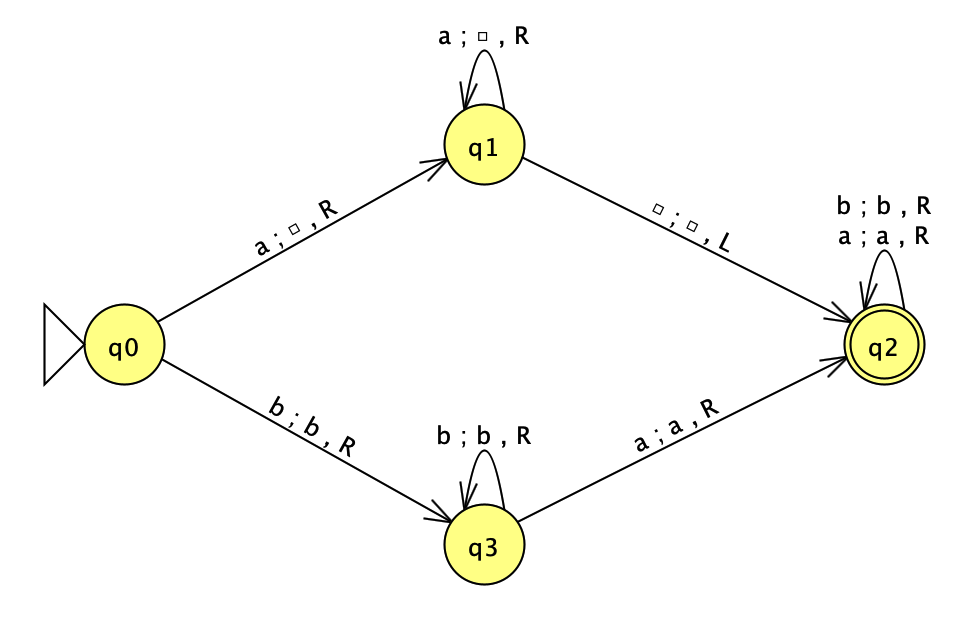
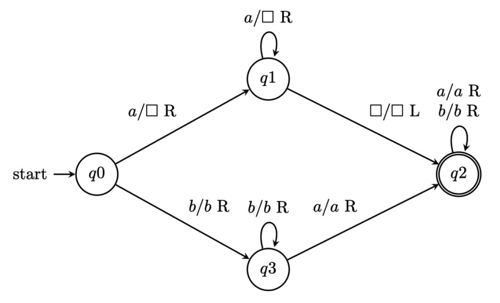

# JFLAP to LaTeX Converter & Turing Machine Diagrams

This project provides a Python tool to automatically convert JFLAP (`.jff`) Turing Machine files into high-quality LaTeX (`.tex`) diagrams using TikZ. It also includes a collection of manually crafted Turing Machine examples.

## JFLAP to LaTeX Converter

Easily turn your JFLAP designs into publication-ready LaTeX diagrams.

### Example

**Input (JFLAP):**


**Output (LaTeX/TikZ):**


### Usage

1.  **Prerequisite:** Ensure you have Python installed.
2.  **Run the script:**
    ```bash
    python3 converter.py <path_to_input.jff>
    ```
    Example:
    ```bash
    python3 converter.py src/test.jff
    ```
    This generates a `.tex` file in the same directory as the input (e.g., `src/test.tex`).

### Converter Features
- **Automatic Scaling:** Converts pixel coordinates to LaTeX cm coordinates.
- **Layout Preservation:** Flips logic to match JFLAP's visual layout.
- **Smart Edges:** Automatically bends bidirectional edges to prevent overlap.
- **Math Mode:** Correctly formats symbols like `\square` (blank).

---

## Included Examples

A collection of handwritten examples is also available in `src/`.

| File | Description |
|------|-------------|
| [`tm-example-template.tex`](src/tm-example-template.tex) | Basic TM template with tape visualization |
| [`tm-equal-ab-count.tex`](src/tm-equal-ab-count.tex) | Decider TM for L = { w ∈ {a,b}* \| nₐ(w) = n_b(w) } |
| [`tm-unequal-ab.tex`](src/tm-unequal-ab.tex) | Decider TM for L = { aᵐbⁿ \| m ≠ n } |

### Previews

#### Example template


#### Equal a/b count


#### Unequal a's and b's


## Requirements

- **Python 3.x** (for the converter)
- **LaTeX Distribution** (TeX Live, MiKTeX, or MacTeX)
- **LaTeX Packages**:
  - `tikz` (libraries: `automata`, `positioning`, `arrows`, `shapes`, `calc`)
  - `amssymb`
  - `geometry`

## Compilation

Compile any `.tex` file (generated or example) using:

```bash
pdflatex src/test.tex
```

## License

MIT License - see [LICENSE](LICENSE) for details.
