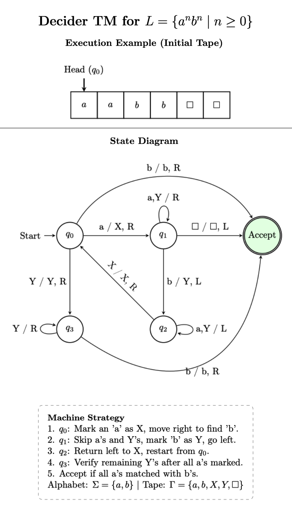
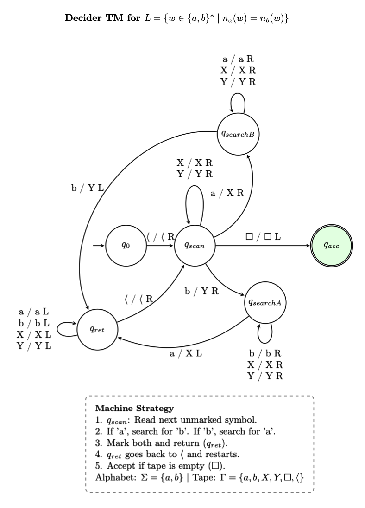

# Turing Machine Diagrams in LaTeX

A collection of Turing Machine state diagrams created with LaTeX and TikZ. These diagrams are useful for computer science courses, particularly for Theory of Computation and Automata Theory.

## Contents

| File | Description |
|------|-------------|
| [`tm-example-template.tex`](src/tm-example-template.tex) | Basic TM template with tape visualization |
| [`tm-equal-ab-count.tex`](src/tm-equal-ab-count.tex) | Decider TM for L = { w ∈ {a,b}* \| nₐ(w) = n_b(w) } |
| [`tm-unequal-ab.tex`](src/tm-unequal-ab.tex) | Decider TM for L = { aᵐbⁿ \| m ≠ n } |

## Previews

### Example template


### Equal a/b count


### Unequal a's and b's


## Requirements

- LaTeX distribution (TeX Live, MiKTeX, or MacTeX)
- Required packages:
  - `tikz` with libraries: `automata`, `positioning`, `arrows`, `shapes`, `calc`
  - `amssymb`
  - `geometry` (for landscape layouts)

## Compilation

Compile any `.tex` file using:

```bash
pdflatex tm-unequal-ab.tex
```

Or use your preferred LaTeX editor (TeXShop, Overleaf, VS Code with LaTeX Workshop, etc.).

## Diagram Conventions

- **States**: Circles with state names (e.g., q₀, q₁)
- **Accept states**: Double circles with green fill
- **Transitions**: Labeled as `read / write direction` where direction is R (right) or L (left)
- **Blank symbol**: □ (square)
- **Start marker**: ⟨ (left angle bracket)
- **Markers**: X and Y used to mark processed symbols

## License

MIT License - see [LICENSE](LICENSE) for details.
